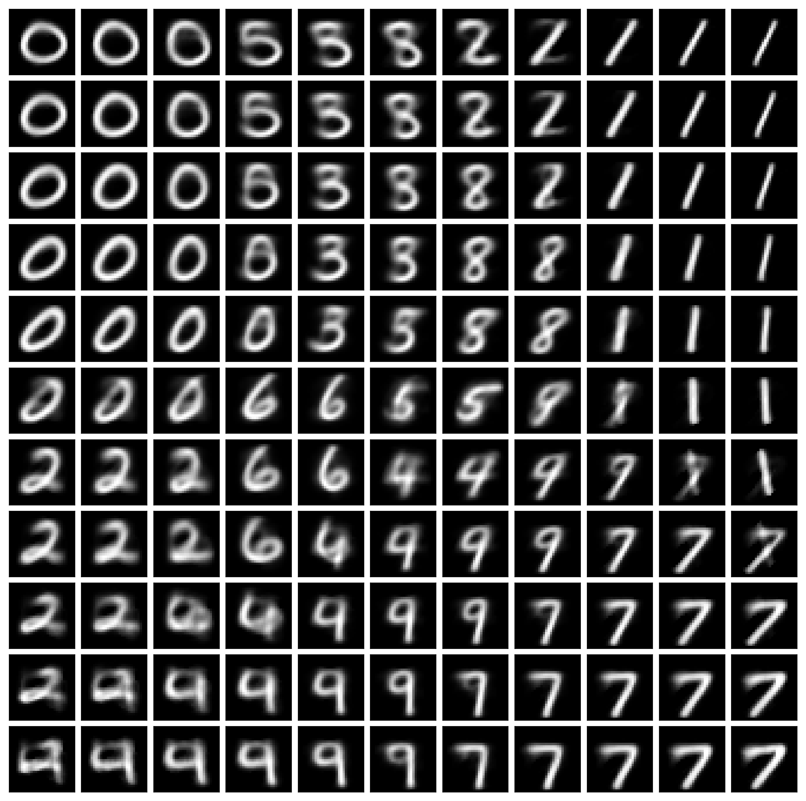
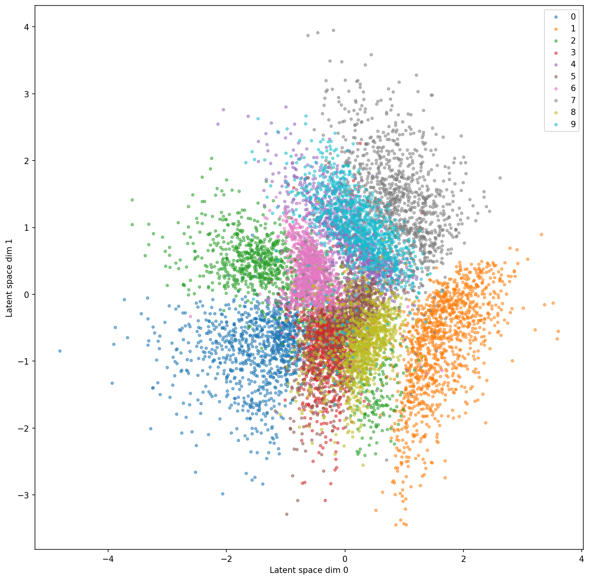

# VariationalAutoencoderPytorch
A comprehensive tutorial on how to implement and train variational autoencoder models based on simple gaussian distribution modeling using PyTorch

## Demo notebooks
- [TrainSimpleGaussFCVAE](./TrainSimpleGaussFCVAE.ipynb) notebook demonstrates how to implement and train very simple a fully-connected variational autoencoder with simple gaussian distribution modeling.

## Tutorial
A step by step tutorial on how to build and train VGG using PyTorch can be found in my [blog post](https://jianzhongdev.github.io/VisionTechInsights/posts/gentle_introduction_to_variational_autoencoders/) (URL: https://jianzhongdev.github.io/VisionTechInsights/posts/gentle_introduction_to_variational_autoencoders/) 

## Example results
Leanred MNIST manifold:


Leanred MNIST latent space distribution:


## Dependency
This repo has been implemented and tested on the following dependencies:
- Python 3.10.13
- matplotlib 3.8.2
- numpy 1.26.2
- torch 2.1.1+cu118
- torchvision 0.16.1+cu118
- notebook 7.0.6

## Computer requirement
This repo has been tested on a laptop computer with the following specs:
- CPU: Intel(R) Core(TM) i7-9750H CPU
- Memory: 32GB 
- GPU: NVIDIA GeForce RTX 2060

## License

[GPL-3.0 license](./LICENSE)

## Reference

[1] Diederik P. Kingma and Max Welling. 2013. Auto-encoding variational Bayes. arXiv preprint arXiv:1312.6114 (2013).

## Citation

If you found this article helpful, please cite it as:
> Zhong, Jian (July 2024). A Gentle Introduction to Variational Autoencoders: Concept and PyTorch Implementation Guide. Vision Tech Insights. https://jianzhongdev.github.io/VisionTechInsights/posts/gentle_introduction_to_variational_autoencoders/.

Or

```html
@article{zhong2024GentleIntroVAE,
  title   = "A Gentle Introduction to Variational Autoencoders: Concept and PyTorch Implementation Guide",
  author  = "Zhong, Jian",
  journal = "jianzhongdev.github.io",
  year    = "2024",
  month   = "July",
  url     = "https://jianzhongdev.github.io/VisionTechInsights/posts/gentle_introduction_to_variational_autoencoders/"
}
```